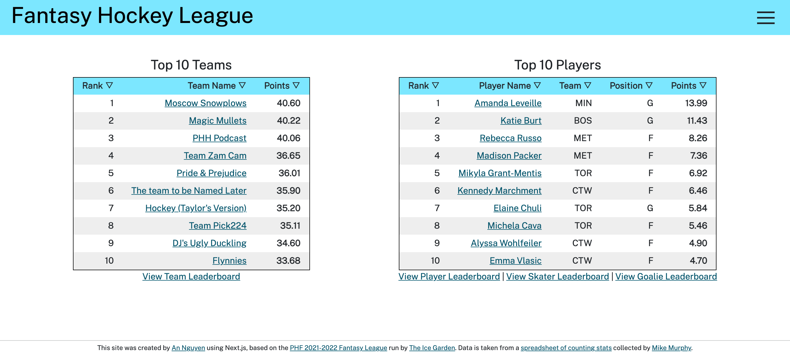

# Fantasy Hockey League

A [website](https://fantasy-hockey-league.vercel.app/) for comparing the teams and players of the PHF 2021-2022 Fantasy League run by [The Ice Garden](https://www.theicegarden.com/). Statistics are taken from a [counting stats spreadsheet](https://docs.google.com/spreadsheets/d/15kkJUbxm7UAyq57Ujxv9BORk2vb06M6Ck1bL7XkPC30/edit?usp=sharing) collected by [Mike Murphy](https://twitter.com/DigDeepBSB), who plays a key role in organizing and facilitating the fantasy league as well and to whom I am eternally grateful.

On the site, you can view ranked leaderboards of fantasy teams and players (overall and subdivided into skaters and goalies), as well as the current statistics of individual teams and players.

This is a [Next.js](https://nextjs.org/) project bootstrapped with [`create-next-app`](https://github.com/vercel/next.js/tree/canary/packages/create-next-app). The data is managed using Firebase, part of Google's Firestore platform for web applications.
